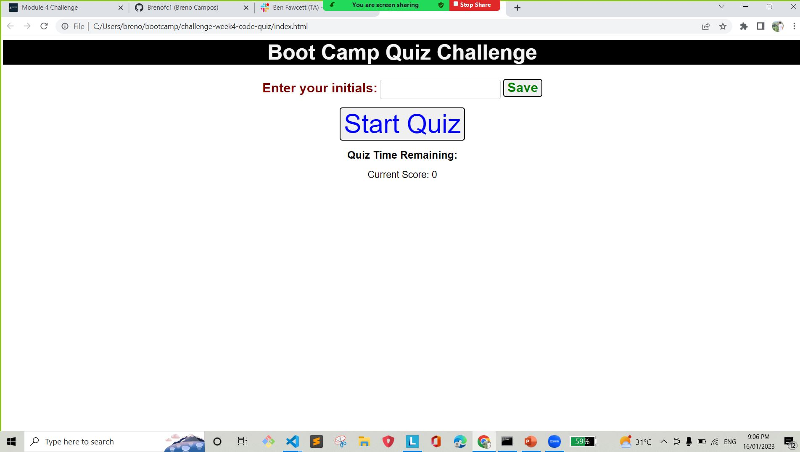

# challenge-week4-code-quiz
Web APIs: Code Quiz

# in this challenge I was asked to create a code quiz where I should give the following attributes:

# Before starting the game, the user may enter its initials (3 letters).
# After the user insert the initials, the display should disappear.
# A start button to start the quiz, so +60 seconds will be added.

# If the user accept the answer, +15 seconds will be added to the current timer.
# If the user do not accept the answer, -15 seconds will be removed from the current timer, and a box containing the correct answer should appear. After clicking on "ok" button it should move to the next question.

# If the timer goes < === 0 seconds, the questions and options should disappear, and the innitials and scores should appear.

# The start button may disappear after started.
# After starting the quiz, a timer should appear.
# On this quiz the user should have different options to be chosen.
# Only ONE option should be correct.
# The game may record the users initials + scores.
# The current score may be displayed.

# When the game is over the list containning all initials from the highest score to the lowest should appear.

# For this code I used a simple html code which should pull the main information from script.com
# The style was done using css style.

 
